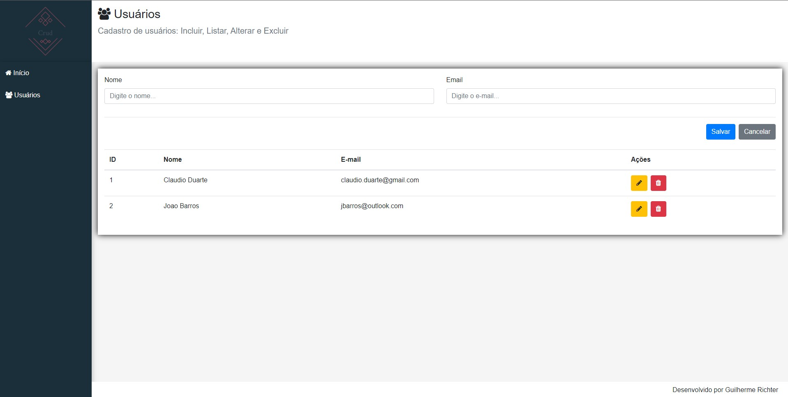

# Sistema de cadastro de usuários

## Table of contents

- [Overview](#overview)
  - [Screenshot](#screenshot)
  - [Built with](#built-with)

## Overview
Sistema de Cadastro de usuários, que recebe input de nome e email, e guarda em um arquivo como objeto json, utilizando json server, o cadastro é dinâmico e pode ser manipulado, guardando informações e as apagando, tudo com uma interface criada em react.

## Screenshot

### Built with

- ReactJs
- NodeJs
- JavaScript
